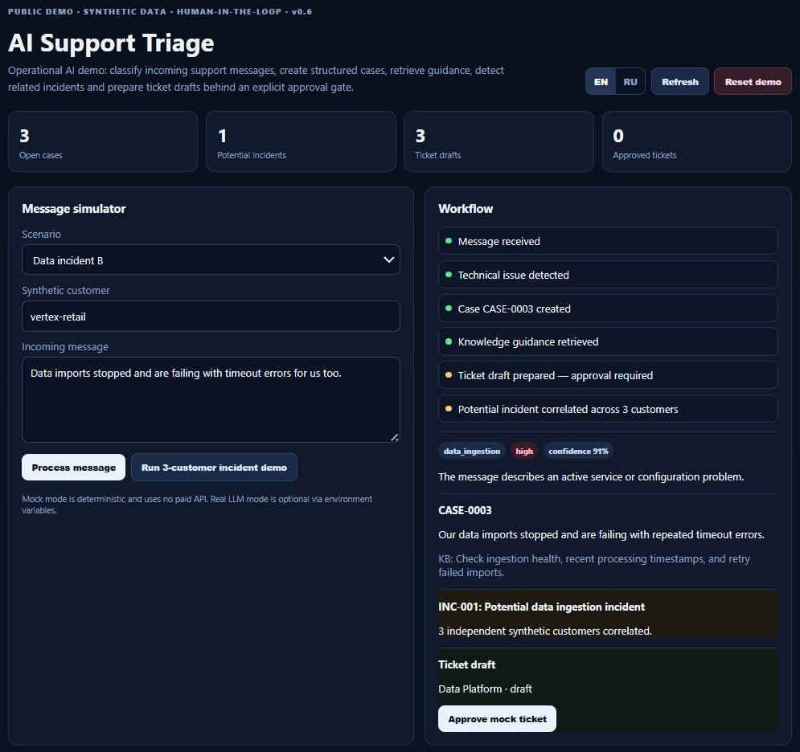

# AI Support Triage Agent

[](https://github.com/damos17/ai-support-triage-demo/actions/workflows/tests.yml)

A runnable, privacy-safe demonstration of an **AI support operations workflow**: issue detection, structured case creation, knowledge retrieval, escalation, cross-customer incident correlation, ticket drafting, persistence, auditability, telemetry, evaluation, and explicit human approval.

> **Public demo:** all customers, messages, rules, identifiers, and integrations are synthetic. This repository contains no production code or internal company data.

**FastAPI · SQLite · LLM provider abstraction · evaluation · incident detection · human approval**

- Runs locally with **no API key** in deterministic mock mode
- Bilingual **EN/RU** scenarios and UI
- Persistent state and audit trail
- CI-tested workflow, API, similarity, and evaluation behavior
- HTML-escaped dynamic UI payloads and hardened Docker build context
- Manual end-to-end QA completed for the v0.6 portfolio release
- MIT licensed

## Dashboard preview



The screenshot shows the three-customer incident demo: three independent synthetic customers produce related `data_ingestion` cases, the workflow correlates them into one potential incident, and ticket creation remains behind explicit human approval.

## What it demonstrates

```text
Incoming message
      ↓
LLM provider / deterministic mock
      ↓
Issue triage + severity
      ↓
Structured case
      ↓
Synthetic knowledge retrieval
      ↓
Decision: resolve / escalate
      ↓
Pluggable similarity engine
      ↓
Cross-customer incident correlation
      ↓
Ticket draft
      ↓
EXPLICIT HUMAN APPROVAL
      ↓
Mock external ticket ID
```

Every meaningful transition is written to a persistent audit trail. Provider latency and token usage are captured at the triage boundary when available.

The point is not to build another chat interface. The project demonstrates how an LLM can sit inside a controlled, stateful workflow where the surrounding application owns persistence, observability, permissions, evaluation, and consequential actions.

## Quick start

### Python

```bash
git clone https://github.com/damos17/ai-support-triage-demo.git
cd ai-support-triage-demo
python -m venv .venv
source .venv/bin/activate  # Windows: .venv\Scripts\activate
pip install -r requirements.txt
uvicorn app.main:app --reload
```

Open `http://localhost:8000`.

Interactive API docs: `http://localhost:8000/docs`.

### Docker

```bash
docker compose up --build
```

Docker is optional; the demo runs directly with Python.

## Operations dashboard

The bilingual EN/RU web UI includes:

- synthetic scenario presets;
- live workflow stages;
- case / severity / confidence output;
- knowledge-base guidance;
- potential incident alerts;
- explicit ticket approval controls;
- counters for cases, incidents, drafts, and approved tickets;
- clickable recent-case navigation;
- case-detail view;
- persistent audit trail;
- LLM provider / latency / token / known-cost telemetry;
- explicit evaluation runner with visible quality metrics;
- one-click three-customer incident demo;
- resettable demo state.

## Mock mode: zero cost

Default configuration:

```env
LLM_MODE=mock
```

No external service or API key is required. The deterministic mock understands the bundled English and Russian scenarios and keeps CI reproducible.

## Optional real LLM mode

The workflow depends on a provider interface rather than one model vendor. An OpenAI-compatible endpoint can be enabled with:

```env
LLM_MODE=openai_compatible
LLM_BASE_URL=https://your-provider.example/v1
LLM_API_KEY=...
LLM_MODEL=...
```

Only the triage boundary is delegated to the provider. Approval policy, persistence, incident state, and ticket execution remain application responsibilities.

If standard usage metadata is returned, prompt/completion token counts are recorded. The demo deliberately does **not** invent a dollar cost for arbitrary compatible providers because pricing is provider- and model-specific.

## Persistence and auditability

Demo state is stored in SQLite under `data/demo.db` by default. Cases, ticket drafts, incidents, and audit events survive an application restart.

Audit events cover message receipt, triage, case creation, knowledge lookup, ticket drafting, incident detection, and explicit approval.

Local database files are ignored by Git and Docker build context.

## Incident correlation

The project exposes a `SimilarityEngine` boundary.

The default implementation is `TokenCosineSimilarity`: local cosine similarity over normalized token-frequency vectors. The incident detector combines:

- issue category;
- independent synthetic customer IDs;
- configurable similarity threshold;
- configurable minimum-customer threshold.

The default engine is deliberately dependency-light and explainable. It is **not** presented as production-grade semantic embeddings. A stronger embeddings implementation can replace it without changing incident orchestration.

## Evaluation

The repository contains a **16-row synthetic bilingual evaluation set** in `data/evaluation.json`: eight English and eight Russian cases covering noise, authentication, data ingestion, configuration, API, integration, performance, and billing.

The report exposes:

- exact row-level pass rate;
- issue / non-issue accuracy;
- category accuracy;
- severity accuracy;
- per-language metrics;
- per-category metrics;
- category confusion entries when misclassifications occur;
- row-level expected vs actual output.

Run regression tests:

```bash
python -m pytest -q
```

Or evaluate the current provider through:

```text
GET /api/evaluation
```

The UI also exposes an explicit **Run evaluation** action. It is never executed silently because a real provider may incur API calls and cost.

The bundled dataset is intentionally small. It is a reproducible regression boundary, **not a claim of real-world model quality**.

## Human-in-the-loop invariant

```text
AI may prepare an action.
AI may not authorize that action.
```

A ticket can be drafted automatically, but a mock external ticket ID is created only after explicit approval.

## Security and deployment boundaries

v0.6 adds portfolio hardening around the public demo:

- dynamic API strings are HTML-escaped before browser rendering;
- common browser security headers are set;
- `.dockerignore` excludes local secrets, databases, virtual environments, Git metadata, and editor files;
- request payloads have bounded input lengths;
- case-ID allocation is guarded against concurrent requests within one application process;
- API-level integration tests cover the main workflow and security behavior.

This is still a **local synthetic demo**, not a production multi-user service. Mutation endpoints intentionally have no authentication so the project stays easy to evaluate locally. Before public internet deployment, add authenticated authorization, session/tenant isolation, rate limiting, production database transactions, migrations, and deployment-specific monitoring.

See [`SECURITY.md`](SECURITY.md) for the explicit boundary.

## API

```text
GET  /health
POST /api/messages
GET  /api/cases?status=&category=&limit=
GET  /api/cases/{case_id}
GET  /api/incidents
GET  /api/audit
GET  /api/telemetry
GET  /api/evaluation
GET  /api/stats
GET  /api/scenarios
POST /api/tickets/{case_id}/approve
POST /api/reset
```

## Project structure

```text
app/
├── main.py          FastAPI routes, response hardening, UI entry point
├── workflow.py      orchestration, audit and state transitions
├── llm.py           provider interface + telemetry capture
├── db.py            SQLite persistence
├── knowledge.py     synthetic retrieval boundary
├── incidents.py     incident correlation orchestration
├── similarity.py    pluggable similarity boundary
├── evaluation.py    synthetic evaluation runner + metrics
├── safety.py        dynamic response escaping for browser rendering
├── ticketing.py     draft + approval gate
├── models.py        domain + audit models
└── templates/       bilingual operations dashboard

data/
├── scenarios.json   synthetic demo scenarios
└── evaluation.json  bilingual evaluation dataset

tests/
├── test_api.py
├── test_workflow.py
├── test_similarity.py
└── test_evaluation.py
```

## Tests, CI, and manual QA

```bash
python -m pytest -q
```

The suite covers workflow safety, persistence, auditability, telemetry, similarity behavior, the public bilingual evaluation dataset, API flows, 404 behavior, browser security headers, and escaping of dynamic message content.

GitHub Actions runs the suite plus a FastAPI version/import smoke check on every push and pull request.

Manual v0.6 QA was also completed against the dashboard:

- noise / resolved-message flow: no case or ticket created;
- authentication outage: case created, knowledge guidance retrieved, ticket stayed in draft;
- explicit approval: draft converted into one mock approved ticket only after the button click;
- three-customer incident demo: three related cases correlated into one potential incident;
- evaluation runner: 100% pass rate on the bundled synthetic EN/RU dataset in deterministic mock mode;
- RU/EN UI switching and reset flow;
- XSS payload rendering: `` displayed as text and did not execute.

## Engineering decisions

**Mock-first, real-model optional.** The project can be evaluated without an API key, while the LLM boundary stays explicit and replaceable.

**State belongs to the application.** The model does not own case history, incident state, ticket state, or authorization.

**Observability is application data.** Audit events and provider telemetry are persistent workflow data, not console-only diagnostics.

**Evaluation is explicit.** A versioned dataset makes quality checks repeatable instead of relying only on hand-picked UI examples.

**Similarity is replaceable.** Incident orchestration depends on a similarity interface instead of a hard-coded lexical algorithm.

**Safety boundaries are visible.** The README and `SECURITY.md` distinguish local-demo choices from production requirements rather than pretending the demo is fully production-ready.

**Synthetic by construction.** No internal customer names, endpoints, credentials, prompts, production schemas, support conversations, or proprietary business rules are included.

## Current version

**v0.6 — Portfolio Hardening**

Adds API integration tests, dynamic response escaping for the dashboard, browser security headers, Docker build-context hardening, single-process concurrent case-ID protection, explicit deployment/security boundaries, an MIT license, a portfolio dashboard screenshot, and completed manual QA.

The next step is not feature expansion. It is keeping the demo stable and using it as a public, privacy-safe proof of AI support automation patterns.

## Related project

This runnable demo complements my sanitized production architecture case study:

**[AI Support Agent — Case Study](https://github.com/damos17/ai-support-agent-case-study)**

---

Built as a public demonstration of **AI automation, agentic workflows, operational safety, observability, evaluation, stateful systems, and human-in-the-loop design**.
